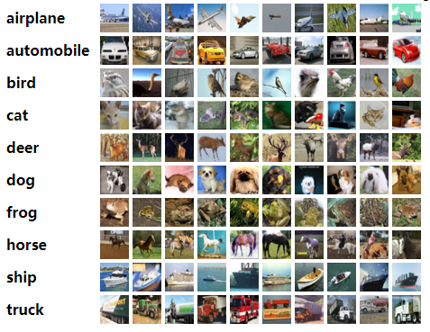
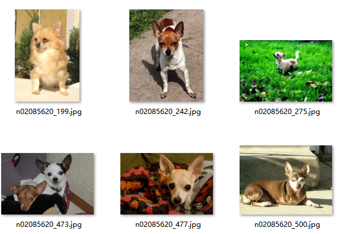

# ToyDataset
小的数据集用于训练测试配置,目前优先关注CV领域的小数据集，方便没有自己数据集的研究人员同行拥有最初的训练数据，数据规模会尽可能减小(1G以内)，同时也欢迎其他领域的人补充其他领域的ToyDataset。

[TOC]

## 1. 图像分类

### 1.1 普通图像分类

MNIST手写体数据集：

- 描述： MNIST手写数字(10个类)数据库的训练集为60,000个示例，而测试集为10,000个示例。 
- 大小: 11MB
- 官网： http://yann.lecun.com/exdb/mnist/index.html 
- 链接：https://pan.baidu.com/s/1VracnPwJCaiP_J0ELxpELw 
  提取码：uczn 
  复制这段内容后打开百度网盘手机App，操作更方便哦
- 评价：分类问题中的Hello World

CIFAR-10数据集：

- 描述： 10个类别的60000个32x32彩色图像，每个类别6000个图像。有50000张训练图像和10000张测试图像。 
- 大小:162MB
- 官网： http://www.cs.toronto.edu/~kriz/cifar.html 
- 链接：https://pan.baidu.com/s/1QgAqmuYfdcoN7bHkCZQhMA 
  提取码：ylfb
- 示例:

### 1.2 细粒度图像分类

StanfordDog数据集：

- 描述：120个种类的狗狗，属于细粒度分类问题，但是由于图片中并不是严格只有狗狗，而含有一定的其他物体或者背景，标注中annoation文件也提供了类似VOC格式的标注，用于标注狗狗在图片中的实际位置，因此也可以用于作为目标检测数据集。
- 大小：735MB
- 官网： http://vision.stanford.edu/aditya86/ImageNetDogs/ 
- 示例:

## 2. 目标检测

## 3. 语义分割

## 4. reid

